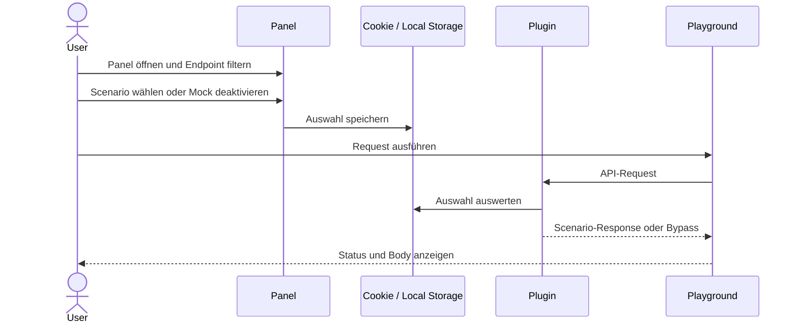
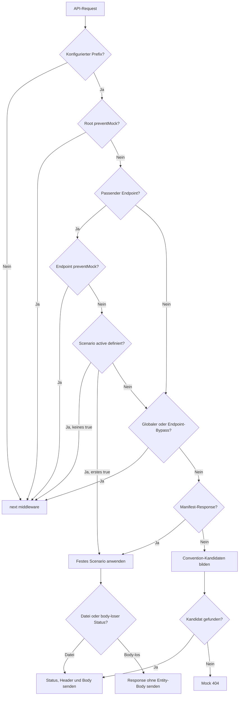
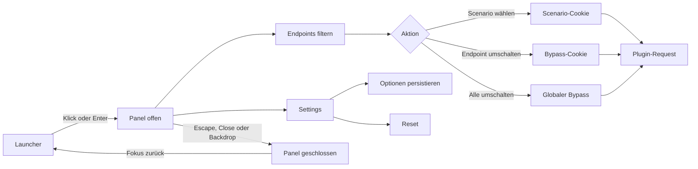

# Testfälle

Diese Datei beschreibt den aktuellen funktionalen Testumfang. Sie ist als Übersicht gedacht: Welche Risiken decken wir ab, welche Klickpfade werden automatisch geprüft und mit welchem Befehl lässt sich welcher Teil der Suite ausführen?

Stand der Suite:

| Ebene                           | Werkzeug                          | Testfälle |
| ------------------------------- | --------------------------------- | --------: |
| Unit- und komponentennahe Tests | Vitest                            |       342 |
| Plugin-Integration              | Vitest mit echtem Vite-Testserver |        29 |
| Browser- und End-to-End-Tests   | Cypress                           |        33 |
| **Gesamt**                      |                                   |   **404** |

Die Zahlen schließen parametrisierte Testfälle einzeln ein.

## Testläufe

| Befehl                              | Umfang                                               |
| ----------------------------------- | ---------------------------------------------------- |
| `pnpm test:all`                     | Unit-, Integrations- und Chrome-Browsertests         |
| `pnpm test:all:demo`                | Alle Tests der Demo                                  |
| `pnpm test:all:playground`          | Alle Tests des Playgrounds                           |
| `pnpm test:all:panel`               | Alle Unit- und Browsertests des Panels               |
| `pnpm test:all:plugin`              | Alle Unit- und Integrationstests des Plugins         |
| `pnpm test:all:ui`                  | Alle Tests der UI-Komponenten                        |
| `pnpm test:all:utils`               | Alle Tests der Browser-Utils                         |
| `pnpm test`                         | Alle Unit- und komponentennahen Vitest-Tests         |
| `pnpm test:app`                     | Nur die Vitest-Tests der Demo                        |
| `pnpm test:package`                 | Nur die Vitest-Tests des Plugins                     |
| `pnpm test:integration`             | Alle Integrationstests                               |
| `pnpm test:integration:plugin`      | Nur die Plugin-Integrationstests                     |
| `pnpm test:browser`                 | Alle Cypress-Suites nacheinander in Chrome           |
| `pnpm test:browser:demo`            | Cypress nur für die Demo                             |
| `pnpm test:browser:playground`      | Cypress nur für das Playground                       |
| `pnpm test:browser:panel`           | Cypress nur für das Panel                            |
| `pnpm test:browser:extended`        | Alle Cypress-Suites in Firefox und anschließend Edge |
| `pnpm test:browser:open:demo`       | Interaktiver Cypress-Runner für die Demo             |
| `pnpm test:browser:open:playground` | Interaktiver Cypress-Runner für das Playground       |
| `pnpm test:browser:open:panel`      | Interaktiver Cypress-Runner für das Panel            |

`test:all` führt zuerst Unit- und Integrationstests aus. Nur wenn diese erfolgreich sind, folgen die Cypress-Suites seriell in Chrome. Der normale Browserlauf bleibt auf Chrome beschränkt. Firefox und Edge sind als langsamer, optionaler Cross-Browser-Lauf zusammengefasst und nicht Bestandteil von `test:all`. In der CI laufen Unit-, Integrations- und Chrome-Browsertests getrennt.

## `apps/demo`

Die Demo repräsentiert die Nutzung des Plugins ohne Panel. Damit sichern wir insbesondere ab, dass weder ein Panel noch bereits vorhandene Lockxy-Cookies Voraussetzung für die Plugin-Funktion werden.

### Vitest

- Die App registriert oder rendert kein `wf-lockxy-panel`.
- Endpoints werden nach ID oder Pfad sowie passend zur HTTP-Methode gefunden.
- Ein einzelnes Scenario wird automatisch gewählt; bei mehreren Scenarios wird die angeforderte ID verwendet.
- Gruppen werden eindeutig und in Manifest-Reihenfolge ermittelt.
- Kein, fester und zufälliger Delay werden für die Anzeige formatiert.
- Das Manifest wird von der festen öffentlichen Route geladen; HTTP-Fehler werden gemeldet.
- Ein Demo-Request erfasst Body, Header, Status und Dauer.
- Ein vom erwarteten Status abweichendes Ergebnis wird als Fehler markiert.

### Cypress: Plugin-only

- Die Demo lädt vollständig, ohne das Panel zu mounten.
- Convention-basierte Mock-Dateien funktionieren ohne Lockxy-Cookie.
- Endpoint-Defaults aus dem Manifest funktionieren ohne Scenario-Auswahl.
- Ein einziges Scenario wird ohne Cookie automatisch verwendet.

### Cypress: Demo-Bedienung

- Ein Convention-Testfall wird ausgewählt, ausgeführt und mit Status, Body und Quelldatei angezeigt.
- Ein absichtlicher `500`-Fehler wird ausgewählt und korrekt dargestellt; die Scenario-Auswahl landet im Cookie.
- Eine echte leere `204`-Antwort wird korrekt behandelt.
- Der Reset löscht die Auswahl und setzt die Response-Ansicht zurück.

## `apps/playground`

Das Playground testet die gemeinsame Verhaltenskette von Panel und Plugin im Browser.

Die Cypress-Suite prüft konkret:

- Ein im Panel ausgewähltes Fehler-Scenario erzeugt im Playground die erwartete `500`-Response.
- Ein einzelner Endpoint kann deaktiviert werden, fällt dann auf die echte App zurück und kann wieder aktiviert werden.
- Der globale Mock-Schalter deaktiviert alle Mocks und stellt sie anschließend wieder her.

## `packages/local-mock-api-ui`

Die UI-Komponenten werden nur auf ihr öffentliches Verhalten geprüft, nicht per Visual Regression.

- `wf-badge`: Default-Ton, Slot-Inhalt und Wechsel des Tons.
- `wf-button`: Click-Event im aktiven Zustand, keine Aktion im deaktivierten Zustand und Lit-Event-Binding.
- `wf-icon`: Default-Icon, dekorative Semantik, Größe und Wechsel des SVG-Pfads.
- `wf-panel`: getrennte Slots für Überschrift, Aktionen und Inhalt.
- `wf-switch`: Event-Verhalten, Checked-State, Accessible Label und deaktivierter Zustand.
- Custom-Element-Registrierung: Ein Element wird nur einmal definiert.

## `packages/local-mock-api-utils`

Die Utils decken normale Nutzung sowie bewusst kaputte oder ungewöhnliche Browserwerte ab.

- Text wird über die Clipboard API kopiert; eine fehlende API bleibt ohne Fehler.
- Blob-Downloads erzeugen einen Download und geben die Object URL wieder frei.
- Objekte, Arrays, primitive Werte, Fehler und leere Werte werden für Previews formatiert.
- Cookie-Namen und -Werte werden vollständig gefunden, geschrieben, URL-kodiert und dekodiert.
- Unicode, Sonderzeichen, Cookie-Trennzeichen und leere Werte werden beim Cookie-Zugriff behandelt.
- Bypass-Cookies unterstützen den globalen Marker sowie mehrere Endpoint-IDs.
- Scenario-Cookies unterstützen mehrere Endpoint-/Scenario-Paare gleichzeitig.
- Erlaubte ID-Zeichen wie Bindestrich, Unterstrich, Zahlen und Groß-/Kleinschreibung bleiben erhalten.
- Leere, doppelte, malformed, kodierte oder unzulässige Einträge werden ignoriert beziehungsweise beim Update bereinigt.
- Beim Hinzufügen, Ersetzen und Entfernen eines Eintrags bleiben andere Endpoint-Auswahlen und ihre Reihenfolge erhalten.
- Einzelne, mehrere, fehlende und explizit leere HTTP-Methoden werden normalisiert.

## `packages/vite-plugin-lockxy`

### Vitest: Plugin-Aufbau und Vite-Anbindung

- Default- und Named-Export liefern dieselbe Plugin-Factory.
- Default- und benutzerdefinierte Mock-Roots werden korrekt aufgelöst und normalisiert.
- Konfigurierte Extensions und Content Types erweitern die Defaults.
- Middleware und isolierter Request-Handler werden korrekt verbunden.
- Das Manifest mit der höchsten Priorität wird gefunden.
- Bereits als Bypass markierte Requests werden an die nächste Middleware weitergereicht.
- Der Mock-Root wird dem Vite-Watcher hinzugefügt, auch wenn er außerhalb von `src` liegt.
- Strukturänderungen bauen den Dateiindex neu auf; reine Dateiänderungen benötigen keinen neuen Index.
- Manifeständerungen laden nur das Manifest neu.
- JSON/YAML-Priorität und Fallback beim Hinzufügen oder Löschen eines Manifests bleiben korrekt.
- Watcher-Events außerhalb des Mock-Roots werden ignoriert.

### Vitest: Requests, Pfade und Dateiauflösung

- Request-Prefixe funktionieren einzeln, mehrfach, leer und unabhängig von ihrer Konfigurationsreihenfolge.
- Query-Strings beeinflussen die Mock-Dateiauflösung nicht.
- Route-Segmente werden dekodiert und auf unsichere Werte wie `..`, Backslashes und fehlerhaftes URI-Encoding geprüft.
- Dateizugriffe außerhalb des Mock-Roots werden verhindert.
- Dateien werden rekursiv indexiert; ein fehlender Mock-Root ergibt einen leeren Index.
- Kandidaten entstehen von der spezifischen Route bis zu Parent-Fallbacks.
- Methodenspezifische Dateien haben Vorrang vor generischen Dateien.
- Vorhandene Extensions werden nicht doppelt ergänzt; eigene Extensions werden berücksichtigt.
- Nur indexierte, noch existierende Dateien werden gelesen; verschwundene Dateien führen sauber zum nächsten Kandidaten.
- Unbekannte Convention-Kandidaten enden in der vorgesehenen Mock-`404`-Response.

### Vitest: Responses und Logging

- Status, Header und Body werden vollständig auf die HTTP-Response geschrieben.
- JSON wird serialisiert und behält seinen Content Type.
- Bekannte Extensions erhalten ihren Content Type; unbekannte erhalten den Binär-Fallback.
- `HEAD`, `204` und andere Body-lose Responses werden ohne unzulässigen Body beziehungsweise Entity-Header behandelt.
- Debug-, Error- und Request-Logging respektieren die Debug-Konfiguration.
- Request-Logs enthalten Methode, URL, Status, Delay und Quelle mit der vorgesehenen Formatierung.

### Vitest: Manifest und Scenarios

- JSON-, YAML- und YML-Manifeste werden gelesen und normalisiert.
- JSON/YAML-Priorität, explizite Dateinamen und Legacy-Dateinamen werden aufgelöst.
- Syntaxfehler nennen Datei sowie möglichst Zeile und Spalte.
- Doppelte YAML-Keys, Custom Tags und übermäßige Alias-Expansion werden abgelehnt.
- Leere und reine Delay-Manifeste sind gültig.
- Ungültige Manifest-Strukturen und Metadaten werden verständlich gemeldet.
- Status- und Delay-Grenzen, ungültige Ranges und nicht ganzzahlige Werte werden validiert.
- Unsichere, fehlende oder nicht als Datei vorhandene Scenario-Referenzen werden unterschieden.
- Explizite und generierte Endpoint-IDs sowie Scenario-IDs werden auf Konflikte geprüft.
- Cookie-untaugliche IDs werden abgelehnt.
- Doppelte oder leere Methoden und überlappende Routen werden erkannt; erlaubte Methoden-/Pfadkombinationen bleiben gültig.
- Statische, erforderliche und optionale URL-Parameter werden gematcht.
- Endpoint-Matching berücksichtigt einzelne Methoden, Methoden-Arrays und `ANY`.
- Root-, Endpoint- und Scenario-Einstellungen werden in der korrekten Priorität angewandt.
- Fester und zufälliger Delay sowie Body-lose Status werden verarbeitet.
- Ein einzelnes Scenario wird automatisch gewählt.
- Bei mehreren Scenarios gilt die Cookie-Auswahl; eine veraltete Auswahl fällt auf das erste Scenario zurück.
- Root- und Endpoint-`preventMock` werden vor Browser-Cookies ausgewertet.
- Sobald ein Scenario `active` definiert, gewinnt das erste `active: true`; ohne `true` wird durchgereicht.
- Mehrere aktive Scenarios werden im Debug-Modus gemeldet, wobei weiterhin das erste gewinnt.
- Kaputte Scenario- und Bypass-Cookies führen nicht zu einem Fehler.
- Globaler und Endpoint-spezifischer Bypass betreffen nur die vorgesehenen Requests.

### Plugin-Integration mit echtem Vite-Server

Die Integrationstests liegen aufgeteilt unter `packages/vite-plugin-lockxy/test/integration`.

#### Convention-Auflösung

- Spezifischster verschachtelter Kandidat; Query-String wird ignoriert.
- Methodenspezifische Datei vor generischer Response.
- Fallback über kürzere Request-Pfade.
- Mehrere konfigurierte API-Prefixe.
- Mock-`404`, wenn kein Kandidat existiert.

#### Manifest

- Normalisiertes Manifest über die öffentliche Manifest-Route.
- Endpoint-Level-Datei, Status und fester Delay.
- Automatische Auswahl eines einzigen Scenarios ohne Cookie.
- YAML als repräsentatives Alternativformat.
- Leeres Manifest, wenn keine Manifest-Datei existiert.
- Ungültige Endpoints werden ignoriert, während der Convention-Fallback weiter funktioniert.

#### Selections und Bypass

- Scenario-Auswahl für IDs mit unterstützten Sonderzeichen.
- Mehrere Endpoint- und Scenario-Einträge in einem Cookie-Header.
- Globaler Bypass für alle API-Requests.
- Endpoint-spezifischer Bypass bei mehreren Einträgen.
- Normales Mocking ohne Lockxy-Cookie.

#### Manifest controls

- Root-`preventMock` reicht alle passenden API-Requests durch.
- Endpoint-`preventMock` reicht nur den betroffenen Endpoint durch.
- Das erste aktive Scenario gewinnt auch gegen globale Bypass- und Scenario-Cookies.
- Eine explizite Scenario-Aktivierung ohne `true` reicht den Request durch.
- `preventMock: false` verhält sich wie ein nicht gesetztes Feld.

#### Response-Typen

- JSON und Text inklusive korrektem Content Type.
- Eine repräsentative eigene Extension (`.xml`) mit eigenem Content Type.
- `HEAD` liefert Header, aber keinen Body.
- `204` und `304` liefern weder Entity-Header noch Body.

#### Watcher

- Nach Serverstart hinzugefügte Convention-Datei wird indexiert und ausgeliefert.
- Gelöschte Convention-Datei wird nicht weiter ausgeliefert.
- Geänderte Manifest-Scenario-Auswahl wird ohne Neustart übernommen.

Der getestete Plugin-Entscheidungsweg lässt sich vereinfacht so lesen:

## `packages/lockxy-panel`

### Vitest: Panel-Zustände und Komponenten

- Manifest wird von der festen Route geladen; Fehlerzustand und Retry werden verarbeitet.
- Ein leeres Manifest mountet kein bedienbares Panel.
- Öffnen und Schließen aktualisiert ARIA-Zustand und Fokus korrekt.
- Launcher, Close-Button, Backdrop und Tabs lösen die vorgesehenen Actions aus.
- Tabwechsel funktioniert mit Pfeiltasten und verschiebt den Fokus.
- Endpoint-Liste unterstützt alle HTTP-Methoden eines Methoden-Arrays.
- Suche filtert Endpoints; leere Trefferlisten haben einen Empty State.
- Kein, ein oder mehrere Scenarios werden passend als Text beziehungsweise Select dargestellt.
- Root-gesteuertes Mocking ersetzt sämtliche Endpoint-Controls durch den Manifest-Hinweis.
- Endpoint-`preventMock` und Scenario-`active` ersetzen nur den betroffenen Endpoint durch den verlinkten Hinweis.
- Endpoint-, Scenario- und globale Proxy-Änderungen erzeugen die richtigen Cookies und Events.
- Settings zeigen Defaults und melden exakt die geänderte Option.
- Proxy-on-load wird gespeichert und beim nächsten Mount angewandt.
- Settings und Endpoint-Auswahlen werden nur mit Manifest-ID projektspezifisch gespeichert.
- Gespeicherte Auswahlen werden anhand Methode und Pfad auch nach einer Endpoint-ID-Änderung wiederhergestellt.
- Fremde, malformed oder nicht mehr vorhandene Auswahlen werden bereinigt.
- Ein entferntes Scenario fällt auf das erste vorhandene Scenario zurück.
- Ein Reset entfernt ausschließlich den Panel-eigenen Zustand und stellt Defaults wieder her.
- Blockiertes oder kaputtes Local Storage führt nicht zum Absturz.
- Positionen werden gespeichert, wiederhergestellt und an alle Viewport-Kanten geklemmt.
- Dragging startet nur mit `Ctrl` beziehungsweise `Cmd`.
- Footer-Aktionen für Reset und Dokumentation werden angeboten.

### Cypress: isoliertes Browser-Verhalten

#### Öffnen und Schließen

- Öffnen setzt den sichtbaren Zustand und verschiebt den Fokus in das Panel.
- `Escape` schließt und gibt den Fokus an den Launcher zurück.
- Close-Button und Backdrop schließen das Panel.
- Wiederholtes Öffnen und Schließen verliert keine Event-Verknüpfungen.

#### Dragging und Viewport

- Dragging mit dem dokumentierten Modifier verschiebt den Launcher und speichert die Position.
- Der Launcher kann an keiner Kante aus dem sichtbaren Viewport gezogen werden.
- Eine gespeicherte Position außerhalb des Screens wird geklemmt.
- Eine Viewport-Größenänderung korrigiert die Position erneut.

#### Tastatur und Barrierefreiheit

- Launcher, Tabs, Suche und Switches sind ohne Maus bedienbar.
- Das Multi-Scenario-Select ist über die natürliche Tab-Reihenfolge erreichbar und verarbeitet eine Auswahl.
- Pfeiltasten wechseln zwischen den Tabs und aktualisieren Fokus sowie ARIA-State.
- Axe findet im geschlossenen Zustand, im geöffneten Panel und in den Settings keine erkennbaren Verstöße.

#### Persistenz und Manifest-Zustände

- Endpoint- und Scenario-Auswahl überleben einen Reload.
- Reset entfernt Browserzustand und stellt Defaults wieder her.
- Manifest-Ladefehler zeigt einen Fehler und kann per Retry wiederhergestellt werden.
- Ein leeres Manifest erzeugt keinen Launcher.
- Ohne Manifest-ID bleibt projektspezifische Persistenz deaktiviert.
- Root-gesteuerte Manifeste blenden Master-Switch, Suche und Endpoint-Liste aus.
- Manifest-gesteuerte Endpoints sind ausgegraut und verlinken in einem neuen Tab zur Kontrollhierarchie.

#### Große und kleine Ansichten

- 100 Endpoints werden gerendert, gefiltert und bedient.
- Eine Suche ohne Treffer zeigt einen verständlichen Empty State.
- Launcher und geöffnetes Panel bleiben auf einem mobilen Viewport sichtbar.
- Das Panel bleibt mobil per Tastatur bedienbar und ohne von Axe erkennbare Verstöße.

Der zentrale Panel-Klickpfad ist damit auf zwei Ebenen abgesichert: isoliert im Panel-Package und gemeinsam mit dem Plugin im Playground.

## Bewusste Grenzen

- `apps/docs` wird nicht getestet.
- Es gibt keine Visual-Regression- oder Screenshot-Vergleiche.
- Es gibt keine Cucumber-/Gherkin-Schicht.
- UI-Komponenten werden auf Funktion, Events und Accessibility-Semantik geprüft, nicht auf pixelgenaues Aussehen.
- Die Plugin-Integration verwendet repräsentative Dateitypen, Verschachtelungen und Kombinationen statt jeder theoretisch möglichen Variante.
- Axe-Checks und Tastaturtests reduzieren Accessibility-Risiken, ersetzen aber kein vollständiges manuelles Audit mit mehreren Screenreadern.
- Der Standardlauf deckt Chrome ab; Firefox und Edge laufen bewusst nur über den erweiterten Browserbefehl.
